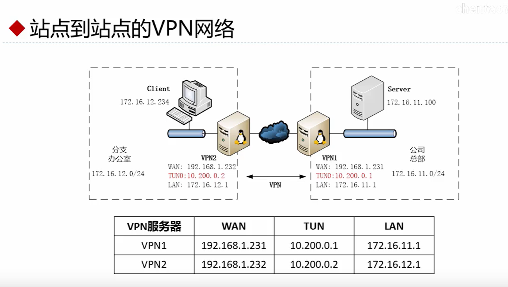

## 目的

使用terraform在阿里云上快速搭建一套测试环境，用于验证openvpn的点对点链路配置

## 参考文档

[使用terraform最佳实践](https://cloud.google.com/docs/terraform/best-practices-for-terraform?hl=zh-cn#naming-convention)

## 配置



### 准备

```bash
# 安装openvpn软件包
yum -y install easy-rsa openvpn
# 启用IP包转发
echo 'net.ipv4.ip_forward=1' >> /etc/sysctl.conf && sysctl -p
# 在vpn1上执行下面的命令生成共享密钥，通过安全信道传到vpn2上
openvpn --genkey --secret secret.key
```

### 配置

在vpn1上执行
```bash
# 准备openvpn server配置文件
cat >> server.conf <<'EOF'
dev tun
proto udp
local 172.16.11.1
port 1194
secret secret.key 0
ifconfig 10.200.0.1 10.200.0.2
# 增加到对端网段的路由
route 172.16.12.0 255.255.255.0
user nobody
group nobody
persist-tun
persist-key
keepalive 10 60
ping-timer-rem
verb 7
daemon
log-append /var/log/openvpn.log
EOF
# 启动openvpn服务
openvpn --config server.conf
```
在vpn2上执行
```bash
cat >> client.conf <<'EOF'
dev tun
proto udp
remote openvpn.lgypro.com 1194
secret secret.key 1
ifconfig 10.200.0.2 10.200.0.1
# 增加到对端网段的路由
route 172.16.11.0 255.255.255.0
user nobody
group nobody
persist-tun
persist-key
keepalive 10 60
ping-timer-rem
verb 7
daemon
log-append /var/log/openvpn.log
EOF
# 启动openvpn服务
openvpn --config client.conf
```

### 验证

在mock-client上

```bash
ping -c 3 172.16.12.1
ping -c 3 10.200.0.2
ping -c 3 10.200.0.1
ping -c 3 172.16.11.1
ping -c 3 172.16.11.100
```

在mock-server上

```bash
ping -c 3 172.16.11.1
ping -c 3 10.200.0.1
ping -c 3 10.200.0.2
ping -c 3 172.16.12.1
ping -c 3 172.16.12.234
```